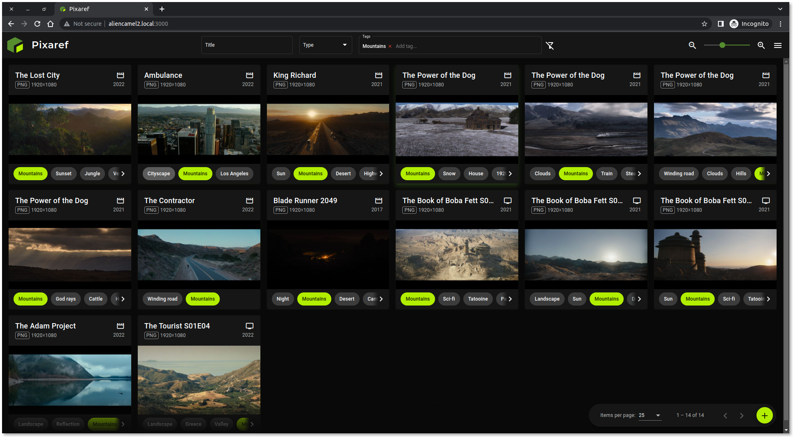
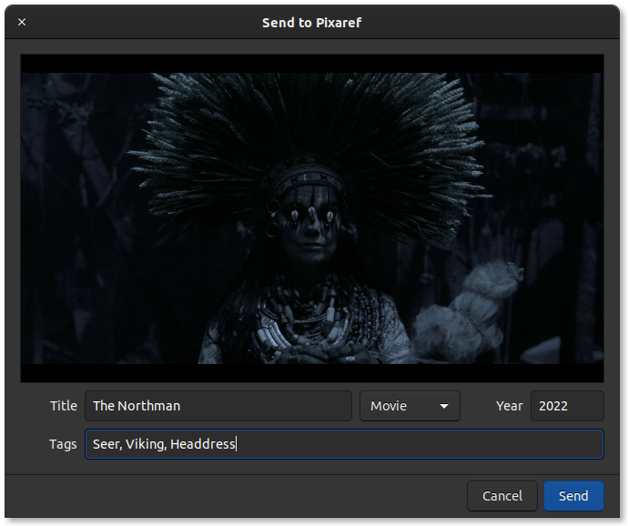

#  Pixaref

Pixaref is a simple reference image management system that allows the user to upload tagged screenshots and other images to a central server. Pixaref was created to address my own need for an application to quickly capture, tag, and upload screenshots that I might later want to use as reference material for my own design work.

Pixaref consists of a web application running on Node.js and a GTK client application, and is intended to be run on a closed home network. You're welcome to give Pixaref a try, but be sure to read through the caveats below before you do so.

## Features
* Add reference images either by using the Pixaref client or by uploading them in the web application
* Preview and download reference images from the web application
* Edit reference image titles, categories and tags in the web application
* Filter on reference image titles, categories and tags 
* Define reference image categories, e.g. "Movie" or "Game"

### Pixaref server
 

### Pixaref client

## Documentation
 * [Installation](docs/INSTALL.md)
 * [Usage](docs/USAGE.md)
 * [Development](docs/HACKING.md)
 * [Caveats](docs/CAVEATS.md)

## License
This work is licensed under a <a rel="license" href="http://creativecommons.org/licenses/by-nc/4.0/">Creative Commons Attribution-NonCommercial 4.0 International License</a>.
  

